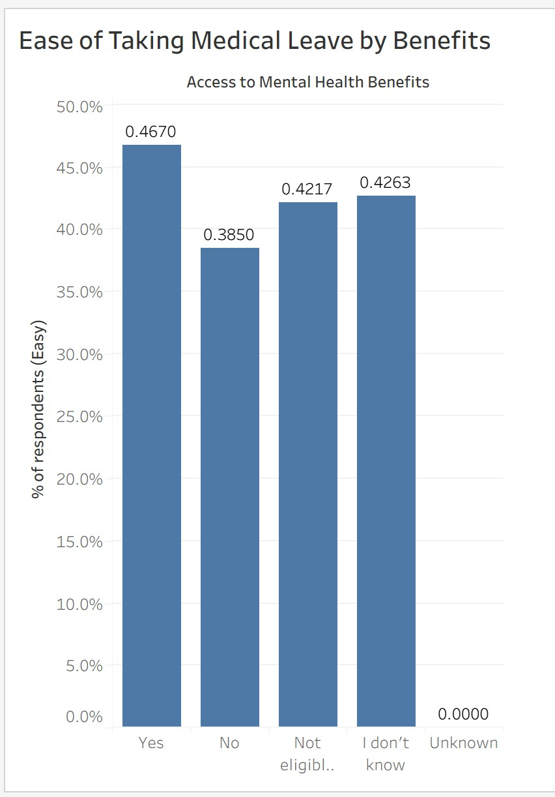
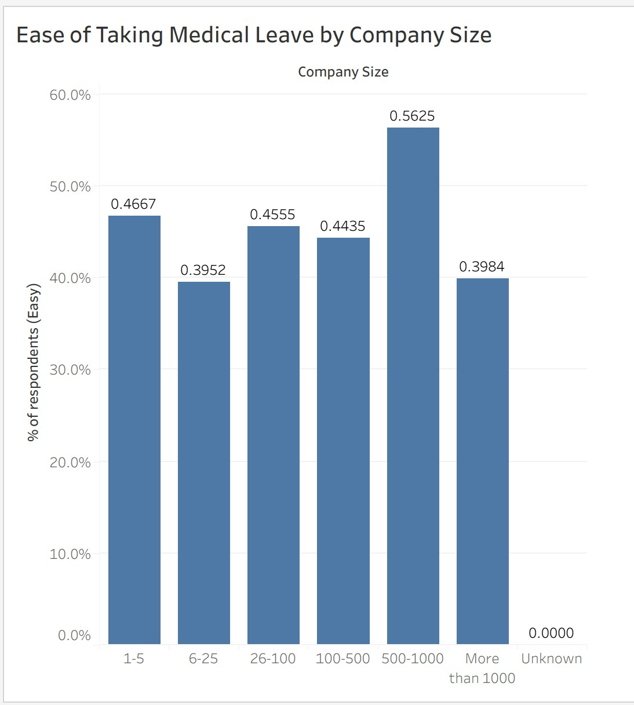

# Mental Health & Medical Leave in the Workplace

##  Project Overview
This project explores workplace mental health and employees’ comfort in taking medical leave using the OSMI Mental Health in Tech Survey dataset (Kaggle).

The objective was to examine how workplace culture, company characteristics, and benefits influence perceptions of medical leave accessibility.

---

##  Dataset Information
- Source: OSMI (Open Sourcing Mental Illness)
- Platform: Kaggle
- Rows: 1,433 survey respondents
- Columns: 63 survey questions
- Data type: Primarily categorical survey responses
- Missing values: Expected due to voluntary survey design

Each row represents one individual respondent.  
Each column represents one survey question.

---

##  Data Challenges & Cleaning
The raw survey data required preprocessing due to:

- Missing values (NaN responses)
- Inconsistent categorical labels
- Long text-based answer variations
- Unstructured survey responses

Data cleaning steps included:
- Renaming long survey column names for clarity
- Handling and analysing missing values
- Standardising categorical responses
- Grouping and simplifying labels
- Preparing data for analysis and visualisation in Tableau

---

##  Tools & Technologies Used

**Programming:**  
- Python  
  - Pandas (data manipulation)  
  - Matplotlib (initial visualisations)

**Visualisation:**  
- Tableau Public (primary interactive dashboards)  

**Environment:**  
- Jupyter Notebook

---

##  Key Research Questions & Findings

### 1️) Mental Health Discussions & Medical Leave
Employees in workplaces with open mental health discussions were significantly more likely to report that taking medical leave would be easy (61.3% in supportive environments).  
This suggests a strong positive association between cultural openness and leave accessibility.

### 2️) Workplace Benefits
Employees with access to mental health benefits reported noticeably higher ease of taking medical leave compared to those without benefits.

### 3️) Company Size
Mid-sized companies (100–500 employees) showed the highest reported ease of medical leave.  
Very small and very large organisations showed lower comfort levels.

### 4️) Gender Differences
Minimal differences were observed across gender groups, with broadly similar distributions of perceived leave accessibility.

### 5️) Tech vs Non-Tech
Tech employees were slightly more likely to report ease of medical leave, but overall distributions were very similar — suggesting workplace culture and policies may be more influential than industry classification.

---

## Visualisations
Below are key dashboards and charts from the analysis.

### Dashboard 1: Overall Medical Leave Ease by Workplace Factors

### Dashboard 2: Impact of Mental Health Discussions

### Medical Leave by Benefits

### Medical Leave by Company Size

### Medical Leave by Gender

### Tech vs. Non-Tech Medical Leave Comfort (Tableau)

### Tech vs. Non-Tech Medical Leave Comfort (Python)

---

##  Presentation

For a full overview of the project, refer to:

**Mental Health Project Presentation PDF**

---

##  Skills Demonstrated
- Data cleaning and preprocessing
- Handling missing survey data
- Categorical data transformation
- Exploratory Data Analysis (EDA)
- Insight generation and interpretation
- Data storytelling through dashboards
- Translating data into actionable workplace insights

---

##  Project Significance
Workplace mental health remains a critical organisational and social issue.  
This analysis highlights how cultural openness, company structure, and employee benefits influence perceived accessibility of medical leave.

The project demonstrates the importance of combining data analysis with contextual understanding to generate meaningful insights.

---
